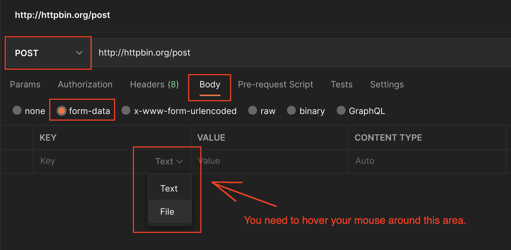

# Testing

You can easily test this application without a client, using [Postman](https://www.postman.com/) to send HTTP Multipart/form requests.

**Creating a Postman request:**
1. Create a new POST request
2. Choose `form-data` type
3. Add key with type `File`, and the key `file`
4. Select the `.zip` file in the testing directory to use in request
5. Do not set Content-type Header, Postman will do this for you

See the image below for what this request looks like:
